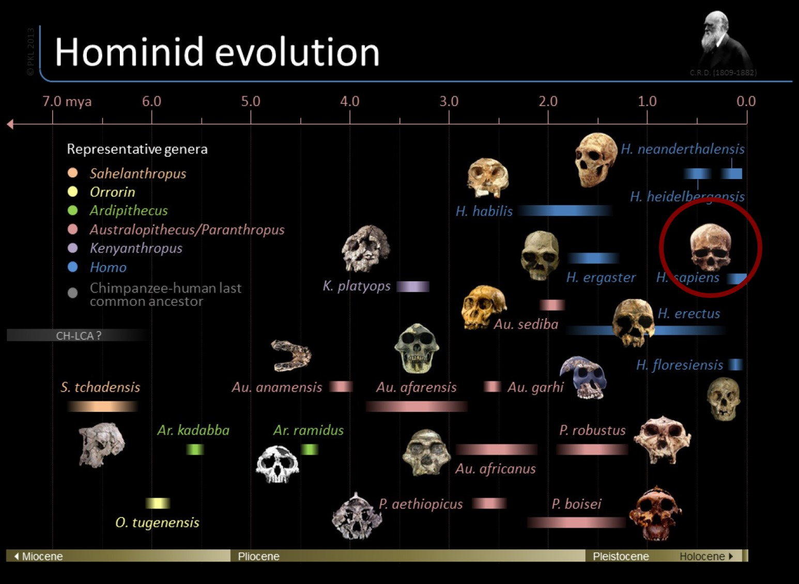
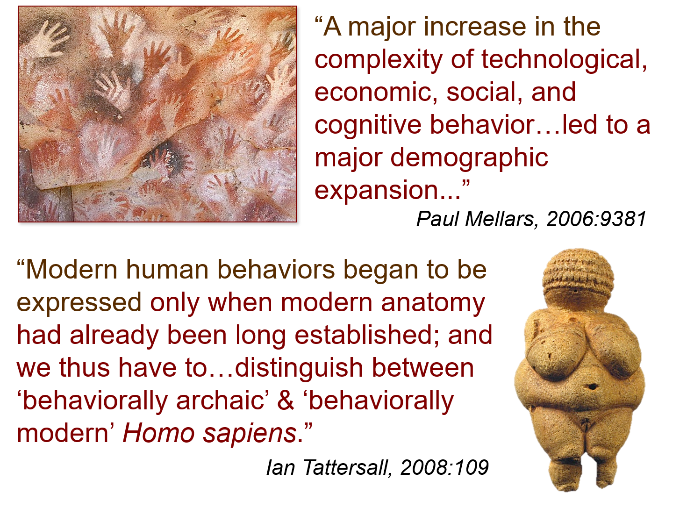
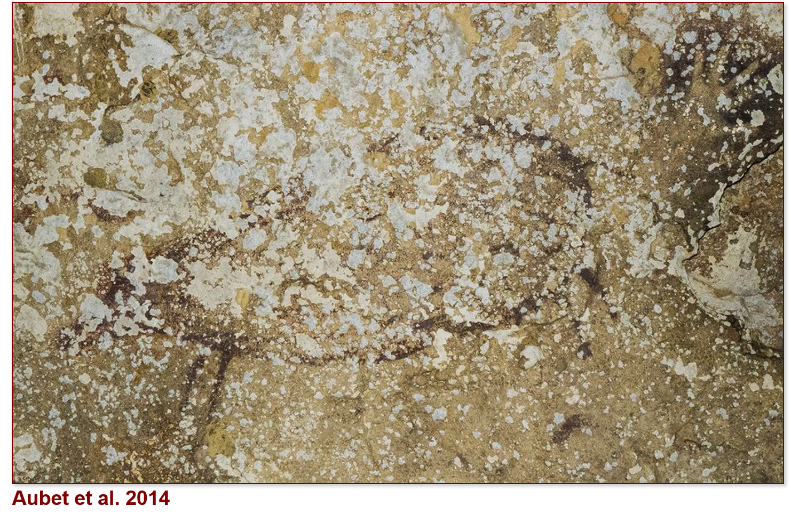
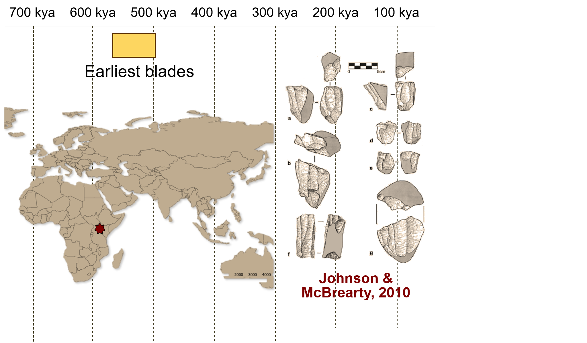

```{r setup, include=FALSE}
options(htmltools.dir.version = FALSE)
```

```{r xaringan-themer, include=FALSE}
library(xaringanthemer)
solarized_dark(
  code_font_family = "Fira Code",
  code_font_url    = "https://cdn.rawgit.com/tonsky/FiraCode/1.204/distr/fira_code.css",
title_slide_background_image = "https://raw.githubusercontent.com/MarcKissel/job_talk/master/title_page_temp2.jpg",

title_slide_text_color = "#1E90FF"
)
```


```{r Setup, include=FALSE}
#i added animate.css to make animations
#see https://www.garrickadenbuie.com/blog/2018/12/03/animate-xaringan-slide-transitions/


#title_slide_background_image = "https://ssdp.org/wp-content/uploads/2018/01/app-state-blog-pic.jpg",

#packages i may need
library(tidyverse)
library(plotly)
library(leaflet)
library(knitr)
library(DT)
library(xtable)
library(kableExtra)
library(ggridges)
library(knitr)

```


---
class: center, middle, inverse

# How can we examine the processes by which we became human?

## genetics
## fossils
## archaeology


---
class: center, inverse

# Two areas
____________


.pull-left[
## - How did we begin to think like humans?


]
.pull-right[

## - When did collective violence evolve?


]

???
# Both have to do with how we view the world and examining the pressures our early ancestors faced

also, note:
class: center, middle

## What pressures did our early ancestors face and *how* did they respond to them?

## Can these responses inform  on causes/consequences of modern human variation?


---
class: inverse


???
begin symoblic stuff
---
class: inverse


---
class: inverse

# **Behavioral Modernity**

- argues that there was a time lag between when ancestors began to *look* human and when they began to *act* human 


???

from start of symoblic to hear abotu 5 mins..

think abut skupping the quotes?
---
class: inverse 


---
class: inverse animated, slideInUp


---

class: inverse
name: Peirce_2

# *Symbolic* is often used as a catchall term but is poorly defined in paleoanthropology
--


need more here

---

Slide on peirce 

---

background-image: url(https://raw.githubusercontent.com/MarcKissel/job_talk/master/Vogleherd.png)
background-position: center
background-repeat: no-repeat
background-size: contain

--
class: middle

.pull-right[

]

---
class: inverse


---
class: inverse



---

class: inverse


---
class: inverse

.pull-left[


]

.pull-right[
#How  we resolve this conflict?

## Comparative approach 
## Intergrative anthropology

]


---
class: inverse
# Database records all instances of human symbolic expression from ~1,000,000-45,000
Maybe add image from pub?

[Worldwide Instances of Symbolic Data Outlining Modernity ](https://marckissel.shinyapps.io/wisdom_database/)


---
class: center, inverse


---

class: inverse


---
class: inverse


---
class: inverse


---
class: inverse


---
class: inverse


---
class: inverse


---
class: inverse


---
class: inverse


---
class: inverse


---
skip next few for timing?

---
class: inverse


---
class: inverse


---
class: inverse



---
class: inverse


---
class: inverse


---
class: inverse


---
class: inverse


---
class: inverse


---
class: inverse 

#conclutions 1


tital to here is about 25 mins if i skop the FADs? gives about 20 mins for warfare and summing up and new work...

##actual conclutions!!!!
stop fetizshing symobl
process rather than event
look at Timeand Mind ppaer?


---

class: center, inverse

#Warfare in our evolutionary past
____________________________________

.pull-left[

##Some argue war is very old


]
--
.pull-right[

##others think it is a product of *civilzation* 

]

???

Organized aggression and violence between socially distinct or autonomous groups of people This paper

---
class: inverse 
# some background here

--
## * Organized violence is a major aspect of modern life for many societies
--

## * Much debate on  whether warfare is a product of more recent human societies, or if it has a longer chronology

---
class: inverse, center

#Types of data:

##Genetics

##Ethnography

##Bioarchaeology

##Archaeology

##Primatology

???

scholars have noted that in hunter-gather populations, the number of people involved in fighting ~40% of the population, but this drops in state-level societies. 

"re people in big, modern societies more or less violent than our forebears? The answer is neither, according to a controversial new study: People who lived in small bands in the past had no more proclivity toward violence than we do today. The finding—based on estimates of war casualties throughout history—undercuts the popular argument that humans have become a more peaceful species over time, thanks to advances in technology and governance. But some critics aren’t convinced.

That includes the man who most recently popularized the idea, psychologist Steven Pinker of Harvard University, who calls the new findings “a statistical gimmick.” He argues in his 2011 book The Better Angels of Our Nature: Why Violence Has Declined that the emergence of institutions like nation-states with strong central governments, trade networks, and wide-ranging communication increased interdependence and reduced deaths due to violence. He cited data suggesting that fewer people die in wars today, relative to a society’s total population, than among small tribes of hunter-gatherers, pastoralists, and horticulturalists—how human society organized for most of its history.

But a team led by anthropologist Rahul Oka at the University of Notre Dame in Indiana wondered whether there was a mathematical explanation for why fewer people proportionally are lost to violence nowadays. They reasoned that as populations get bigger, their armies don’t necessarily grow at the same rate. In a small group of 100 adults, for example, it would be perfectly reasonable to have 25 warriors, says anthropologist and study co-author Mark Golitko, also at Notre Dame. But in a population of 100 million, supporting and coordinating an army of 25 million soldiers is logistically impossible, to say nothing of such an army’s effectiveness. Researchers call that incongruity a scaling effect."

---
class: inverse, center


---
class: inverse


---
class: inverse

## But is it that simple? We looked at other factors that may be driving this apparent relationship

--

##Maybe the drop is due to broader issues that appear as population size increases
---
class: inverse 

presenter notes

???
To test this collected data on population & war group size for ~300 socieites and data from speicfic historical conflicts


is this drop in the number of people involved in war (what we call the “war group”) due to the effects of living in a state or is it a reflection of broader issues that appear when population increases?
We collected data on population and war group size from 295 societies and on war group size and conflict-related casualties from 430 historical conflicts going back to 2500 B.C. We show that, as population goes up, the proportion of people involved in conflict decreases.  In other words, it is not that states prevent violence, but rather that other factors, such as the need to feed, cloth, and arm a war group makes it harder to involve a large percentage of people in more complex societies. 

---
class: inverse


```{r datatable for war, warning=FALSE, message= FALSE, echo=FALSE}
war <- read_csv("PopSizeTemp.csv") ##### or temp file?

```

```{r code for figure 1a1, warning = FALSE, echo = FALSE}
#plot_Fig1a1 <- ggplot() + geom_point(data = war, aes(x= log(Population), y = log(Overall_War_Group_Size_W), color = Time_Type))+ geom_smooth(data = war, aes(x= log(Population), y = log(Overall_War_Group_Size_W), group=1),method="lm") + geom_point(data= war, aes(x= log(Population), y = log(W.P), color = Time_Type)) + geom_smooth(data = war, aes(x= log(Population), y = log(W.P), group=1),method="lm")


plot_Fig1a1 <- ggplot() + geom_point(data = war, aes(x= log(Population), y = log(Overall_War_Group_Size_W), color = Time_Type, text = paste("Society: ", Society) ))+ geom_smooth(data = war, aes(x= log(Population), y = log(Overall_War_Group_Size_W), group=1),method="lm") + geom_point(data= war, aes(x= log(Population), y = log(W.P), color = Time_Type, text = paste("Society: ", Society))) + geom_smooth(data = war, aes(x= log(Population), y = log(W.P), group=1),method="lm")

```


```{r, warning=FALSE, message= FALSE, echo=FALSE}
ggplotly(plot_Fig1a1, height = 600, width = 800)
```

Fig1a: Scaled distribution of P vs. W and W/P from Dataset S1 (n = 295). W and W/p


---
class: inverse

##We calcualted the relative measure of the number of individuals involved in conflict accounting for scale in group population and used this to study change over time

$$\frac{W}{P} = KP^{x-1}$$

data suggests that there is no difference in DCI between small-scale societies observed during times of conflict and contemporary or recent state-level societies preparing for or engaged in active conflict. 


???
Demographic conflict investment: relative measure of number of individuals involved in conflict accounting for scale in group population

The exponent X serves as a measure of how many individuals
are being committed to the unit’s war group, hereafter
known as demographic conflict investment (DCI) in relation to P.

DCI is remarkably sensitive at identifying changing conflict
needs and shows fluctuations even for small engagements,
especially in earlier periods, where personnel are the primary
investment rather than technology.
ii) Trends in DCI show some decreasing demographic investment
in conflict over time, suggesting that most modern
nations have reached optimal sizes of armies that they can
and desire to sustain at any time subject to population conflict
needs, other economic or cultural considerations, or
investments in conflict technology rather than personnel,
all of which may contribute to declining DCI.
iii) Increases in DCI at the time of major conflict are significant
indicators of conflict investment, regardless of technology, as
states tend to increase numbers of combatants in the field
during active combat. This is especially pertinent given the
lessons from the Iraq War (2003–2011), Afghanistan (2001 to
present), and Syria (2011 to present) that clearly show that
technology may not easily replace “boots-on-the-ground.”

---
DCI is correlated with the global militarization index, but can be applied to any population or social system.

Can be used to track changes in conflict investment over time for any geographic or temporal context provided that population and war group size can be reliably measured or estimated.

---
class: inverse
Maybe make larger in the chunk

```{r, warning= FALSE, error=FALSE, echo=FALSE}
p <- ggplot(data=DCI_interact, aes(x=reorder(country, X, na.rm=TRUE), y = X, fill= country))
DCI_box <- p + geom_boxplot() +labs(x=NULL, y = "DCI values", title = "boxplot of DCI") +coord_flip() + guides(fill=FALSE) #last argument is so that the legend doesn't show up
DCI_box
            
```

---
class: inverse

```{r interactive plot, message=FALSE, echo=FALSE}

#setup data

DCI_interact <-  DCI %>% gather(value = X, key = country, Belgium:Iraq)


plot_DCI <- ggplot(DCI_interact, aes( x=Year, y = X, group=country, color = country)) + geom_line() + ylab("DCI")
plot_DCI <- ggplotly(plot_DCI, height = 600, width = 800)
#p

#plot_DCI %>% layout(autosize = F, width = 800, height = 800)

plot_DCI
```


---
class: inverse
MOTION PLOT

```{r data for interactive DCI, eval=FALSE, message=FALSE, include=FALSE}
DCI <- read_csv("X_Factor_Dataset.csv")
DCI_interact <-  DCI %>% gather(value = X, key = country, Belgium:Iraq)
DCI_summary <- DCI_interact %>% group_by(country) %>% summarise(DCI_mean = mean(X, na.rm = TRUE), DCI_sd = sd(X, na.rm = TRUE))
#setup data

DCI_motion <-ggplot(DCI_interact, aes(x= Year, y = X, group =country, frame = Year, color = country, label=country, size = X)) + geom_point() + geom_label(aes(Year, X, label=country)) 
                     

```


```{r motion plot, eval=FALSE, message=FALSE, warning=FALSE, include=FALSE}

ggplotly(DCI_motion, height = 600, width = 800) %>% animation_opts(300, redraw = F)


```


---

---
class: center inverse
background-image:url(https://raw.githubusercontent.com/MarcKissel/job_talk/master/Science_1.png) 
background-size: contain

---
class: center inverse
background-image:url(https://raw.githubusercontent.com/MarcKissel/job_talk/master/Science_1.png) 
background-size: contain
--


---
class: center inverse
background-image:url(https://raw.githubusercontent.com/MarcKissel/job_talk/master/Science2.png) 
background-size: contain


---
name: warfare_conclution
class: inverse 
# conclutions 

##We are not more or less violent than our forebears

##Rather, population size is a confounding factor

???
hey reasoned that as populations get bigger, their armies don’t necessarily grow at the same rate. In a small group of 100 adults, for example, it would be perfectly reasonable to have 25 warriors, says anthropologist and study co-author Mark Golitko, also at Notre Dame. But in a population of 100 million, supporting and coordinating an army of 25 million soldiers is logistically impossible, to say nothing of such an army’s effectiveness. Researchers call that incongruity a scaling effect.

---
in total up to here about 40 mins. ~15 mins on warfare....
this gives about 10 mins to talk about new stuff etc...

---
DCI OVERVIEW  MORE

???
Demographic Conflict Investment (DCI) is a relative measure of the number of individuals involved in conflict accounting, for scale in group population. Our data suggests that there is no difference in DCI between small-scale societies observed during times of conflict and contemporary or recent state-level societies preparing for or engaged in active conflict. 

Even more interesting, it is seen as a measure of conflict investment. It is strongly correlated
with the most commonly used measure of investment in conflict, the global militarization index, but can be applied to any population or social system. It thus can be used to track changes in conflict
investment over time for any geographic or temporal context provided that population and war group size can be reliably measured or estimated.


To examine this data visually, the next graphs shows the DCI range for each country, giving the mean and the 1 sd range, and then a boxplot of the data

---
#part 3 New stuff
---
#data visulzations 
 think about shiny
 
---
class: inverse

```{r  CC data table, message=FALSE, error=FALSE, warning=FALSE, echo=FALSE}
library(knitr)
library(kableExtra)
cc_edited <- cc %>% select(Specimen, Species_2, Cranial_capacity, Age_in_MA, Source)
cc_edited <- cc_edited %>% rename(Speices = Species_2)
kable(cc_edited,'html') %>% 
  kable_styling(bootstrap_options = c("striped", "hover", "responsive")) %>% scroll_box(width = "700px", height = "300px")

```


---

class: inverse

```{r read in CC, error=FALSE, message=FALSE, warning=FALSE, include=FALSE}
cc <-read_csv("CC_data_Updated_2.csv") #read in data
p2 <- ggplot(cc, aes(x = Age_in_MA_rounded, y = Cranial_capacity, color = Species_2, label = Specimen)) + geom_point() 
#p2
```


```{r plot scatter, message=FALSE, error=FALSE, warning=FALSE, echo=FALSE, fig.width=12, fig.height=8}
p3 <- p2 + theme(text = element_text(size = 20))
ggplotly(p3)

```


---

class: inverse


```{r error=FALSE, message=FALSE, warning=FALSE, include=FALSE, fig.width=12, fig.height=8}
p_box <-  ggplot(cc, aes(x = reorder(Species_2, Cranial_capacity, na.rm = TRUE) , y = Cranial_capacity, fill = Species_2)) + geom_boxplot() + coord_flip() +labs(y= "Cranial Capacity", x = NULL)

p_box

#ggplotly(p_box, height = 600, width = 800)
```


```{r ridge_plots_2, message=FALSE, error=FALSE, warning=FALSE, echo=FALSE, fig.width=12, fig.height=8 }
cc <-read_csv("CC_data_Updated_4.csv") #read in data

cc$Specimen<-iconv(enc2utf8(cc$Specimen),sub="byte") #fix the format of Specimen col

#cc %>% group_by(Species_2) %>% summarise(max(Age_in_MA_rounded), min(Age_in_MA_rounded))


plot10 <- ggplot(cc, aes(x = Cranial_capacity, y = reorder(Species_2, -date2 ),fill = Species_2)) + geom_density_ridges() + theme_ridges() + labs( caption = "data from Schoenemann 2013 & Hawks et al 2017", fill ="Species")

plot10a <- plot10 + annotate("text", label = "", x =1, y =1) + theme(axis.title.y = element_blank()) + labs(x="Cranial Capacity in cm^3")

plot10a + theme(text = element_text(size = 20)) + theme(axis.text = element_text(size = 20)) + theme(legend.position="none")

```


---
#Fieldwork

## Zanzibar

## France 


---
# Research

# WISDOM

# Warfare

# Extended Evolutionary Synthesis

# MORE


---


to add: 

- change text size  on war group plots so it is easier to readf
- make a violin plot of the DCI values?
- slide with this:
 
## What pressures did our early ancestors face and *how* did they respond to them?

## Can these responses inform  on causes/consequences of modern human variation?
