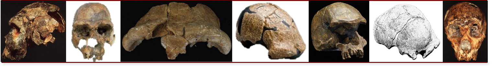
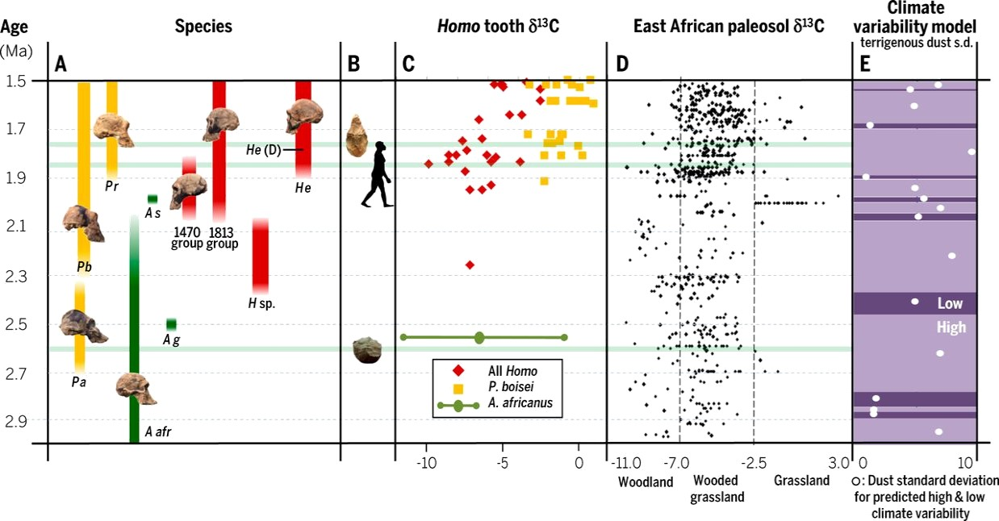
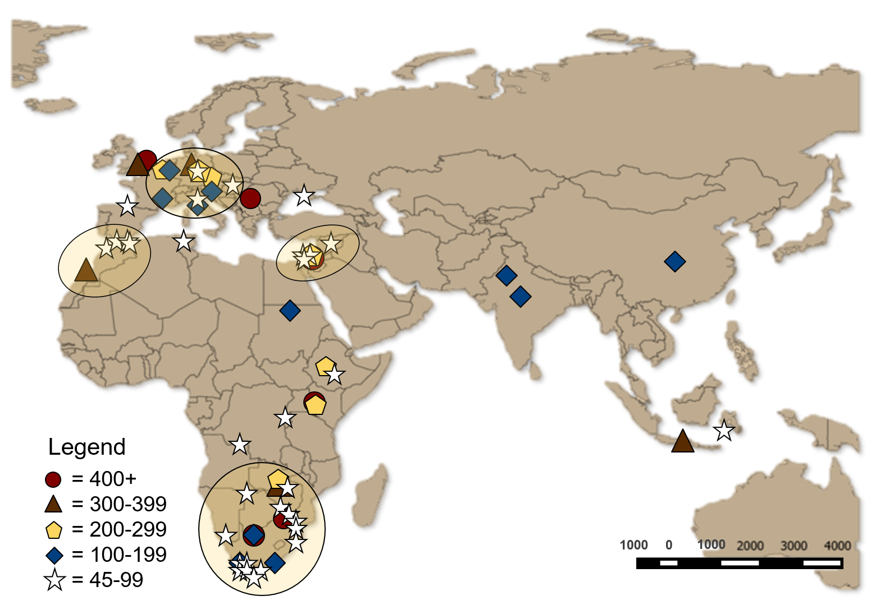
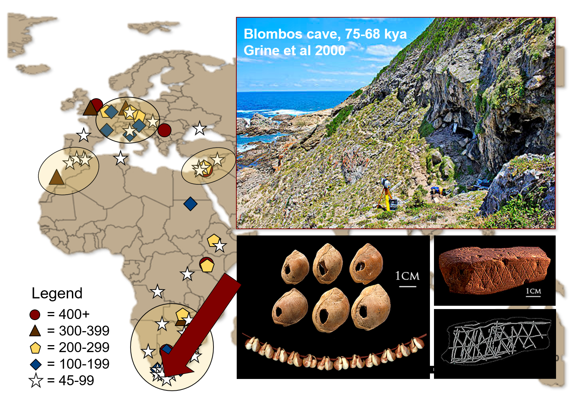

```{r setup, include=FALSE}
options(htmltools.dir.version = FALSE)
```

```{r xaringan-themer, include=FALSE}
library(xaringanthemer)
solarized_dark(
  code_font_family = "Fira Code",
  code_font_url    = "https://cdn.rawgit.com/tonsky/FiraCode/1.204/distr/fira_code.css",
title_slide_background_image = "https://raw.githubusercontent.com/MarcKissel/job_talk/master/title_page_temp2.jpg",

title_slide_text_color = "#1E90FF"
)
```


```{r Setup, include=FALSE}
#i added animate.css to make animations
#see https://www.garrickadenbuie.com/blog/2018/12/03/animate-xaringan-slide-transitions/


#title_slide_background_image = "https://ssdp.org/wp-content/uploads/2018/01/app-state-blog-pic.jpg",

#packages i may need
library(tidyverse)
library(plotly)
library(leaflet)
library(knitr)
library(DT)
library(xtable)
library(kableExtra)

```


---
background-image: url(https://github.com/MarcKissel/job_talk/blob/master/title_temp1.png)

---
background-size: 100%
background-image: url(https://media.giphy.com/media/94iS62lx8CRQA/giphy.gif)

---
background-size: 100%
background-image: url(https://raw.githubusercontent.com/MarcKissel/job_talk/master/title_page_temp2.jpg)

---
image-size: 100%


---
class: center, middle, animated, slideInRight


#Paleoanthropology is not *very* integrative 


---


---
class: center, middle

## What pressures did our early ancestors face and *how* did they respond to them?

## Can these responses inform  on causes/consequences of modern human variation?



---
background-image: 


---

class: inverse


---
class: inverse




---
class: inverse




---
notes: look at rhe Rladies template for ideas on pics
also, store images in img folder? might make things easier?


see: 
https://alison.rbind.io/post/r-ladies-slides/
and 
https://github.com/rbind/apreshill/blob/master/static/slides/blogdown-workshop-slides.Rmd

other ideas:
i like the title slide, but maybe the next slide coild have titel as well but as a png file from ppt. MMight look nice

- CHECK IF IT WORKS ON ANOHTER Computer...might need the style shhet..somethig in the insturctiosn talks abut thhis

- think about zoom!
https://bookdown.org/yihui/rmarkdown/reveal-js-plugins.html


- do a datatable as is below with iris for something


think about background image for a slide::

background-image: url(https://c2.staticflickr.com/6/5729/30943501632_eb0b200eed_b.jpg)
class: center, top
# Rock Cairn Hiking

this could also work  for the maps i have. have the background be the map and the transisotns be the artifcats? also could work for the time line? 


other things to tink about and trick below are from these notes:
these notes are super useful too:
https://dukeslides.johnlittle.info/slides/index.html#37

---
## Two Column

.pull-left[
- You can generate a left column 

- by wrapping the left-hand text in `.pull-left[` foo `]`

- TAGS &lt;sup&gt;1&lt;/sup&gt;

- Splunk
]

.pull-right[
- You can generate a right column 

- by wrapping the right-hand text in `.pull-right[` foo `]`

- foo

- foo &lt;sup&gt;2&lt;/sup&gt;
]


---
background-image: url(https://upload.wikimedia.org/wikipedia/commons/thumb/e/e6/Duke_University_logo.svg/640px-Duke_University_logo.svg.png)


---
# Modifying text

.pull-left[

## Font sizes

This is normal size ( `\(\LaTeX\)`-friendly terms)

.Large[Large]

.large[large]

.small[small]

.footnotesize[footnotesize]

.scriptsize[scriptsize]

.tiny[tiny]

]

.pull-right[

## Text color

.black[black]

.red[red]

.blue[blue]

.green[green], 
.yellow[yellow], 
.orange[orange], 
.purple[purple], 
.gray[gray or grey]

You can also use `.bold[]` or `.bolder[]` to emphasize text 

This is .bold[bold], this is .bolder[bolder] and this is regular markdown **double-star bold** (visible differences depend on the font)

]

.content-box-green[.scriptsize[.justify-center[
[Hegge CSS](http://biostatistics.dk/presentations/xaringan/ghoul.html) + [Duke Color Palette](https://styleguide.duke.edu/color-palette/) = hegge-duke.css]
]]]

---

## Coloured content boxes

Use `.content-box-blue` (or gray/grey, duke-green, green, purple, red, or yellow) to produce a box with coloured background. Size depends on content.

`.content-box-blue[I feel blue]` yields

.content-box-blue[I feel blue]

Wrap in `.full-width` to expand the width

.full-width[.content-box-red[I feel wide and red]]

If you have content in columns then you get

.pull-left[.full-width[.content-box-yellow[**WARNING** Look out for minons or bananas]]]
.pull-right[.full-width[.content-box-yellow[The box to the left was created using `.pull-left[.full-width[.content-box-yellow[]]]`]]]


---

## Coloured content boxes

Use `.content-box-blue` to produce a box with blue background. Size depends on content.  color has the following options:  `.content-box-color` where color is   blue | gray | grey | neutral | duke-green | green | purple | red | yellow

&amp;nbsp;

.content-box-blue[blue]
.content-box-gray[gray]
.content-box-grey[grey]
.content-box-neutral[neutral]

&amp;nbsp;

.content-box-duke-green[duke-green]
.content-box-green[green]
.content-box-purple[purple]

&amp;nbsp; 

.content-box-red[red]
.content-box-yellow[yellow]


---


```{r echo=FALSE}
DT::datatable(
  head(iris, 10),
  fillContainer = FALSE, options = list(pageLength = 8)
)
```


---