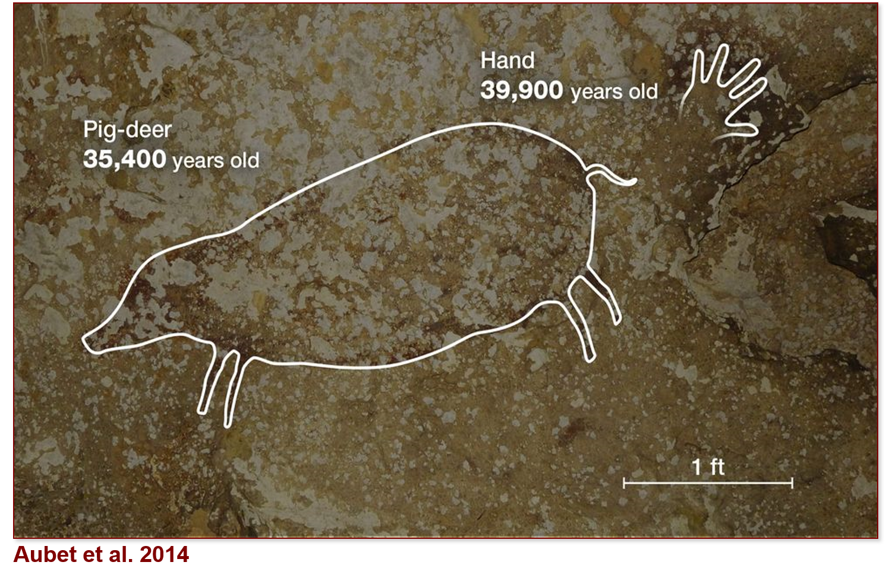
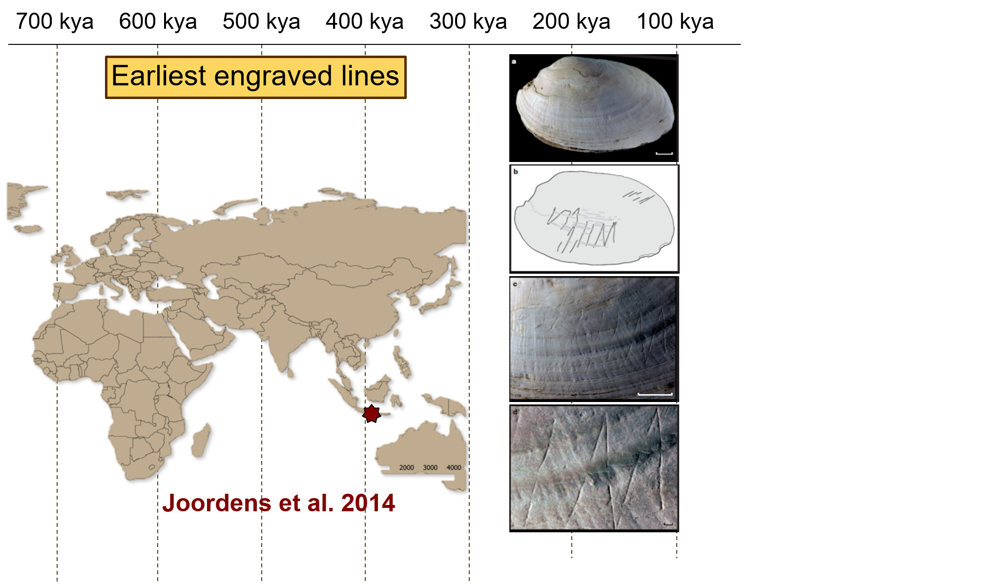
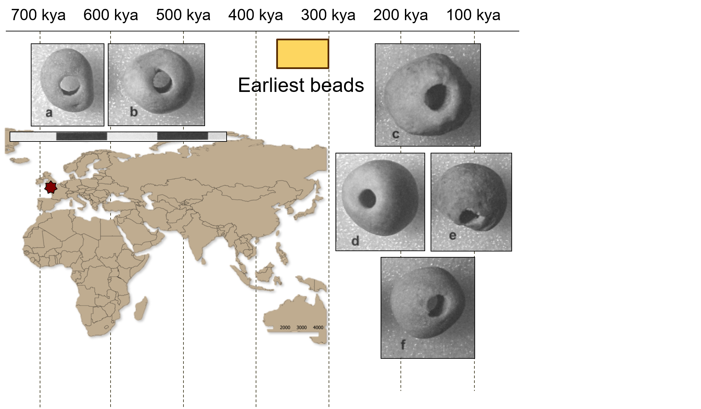

```{r setup, include=FALSE}
options(htmltools.dir.version = FALSE)
```

```{r xaringan-themer, include=FALSE}
library(xaringanthemer)
solarized_dark(
  code_font_family = "Fira Code",
  code_font_url    = "https://cdn.rawgit.com/tonsky/FiraCode/1.204/distr/fira_code.css",
title_slide_background_image = "https://raw.githubusercontent.com/MarcKissel/job_talk/master/title_page_temp2.jpg",

title_slide_text_color = "#1E90FF"
)
```


```{r Setup, include=FALSE}
#i added animate.css to make animations
#see https://www.garrickadenbuie.com/blog/2018/12/03/animate-xaringan-slide-transitions/


#title_slide_background_image = "https://ssdp.org/wp-content/uploads/2018/01/app-state-blog-pic.jpg",

#packages i may need
library(tidyverse)
library(plotly)
library(leaflet)
library(knitr)
library(DT)
library(xtable)
library(kableExtra)
library(ggridges)
library(knitr)

```


---
class: center, middle, inverse 

# How can we examine the processes by which we became human?

## genetics
## fossils
## archaeology


???
maybe format a ppt slide as background image here that looks nice?
and then have the intergrative slide appear? or try below:

---

Here is some text

---
class: center, middle, inverse

# How can we examine the processes by which we became human?

## genetics
## fossils
## archaeology

--

In general, Paleoanthropology is not *very* integrative 

---


class: center, middle, inverse

# Two areas HELLO

- How did we begin to think like humans

- When did collective violence evolve

---

---
class: center, middle, inverse

# Two Questions
.pull-left[
# - How did we begin to think like humans


]
.pull-right[
# - When did collective violence evolve


]

--
# Both have to do with how we view the world and examining the pressures our early ancestors faced

???
up to here ~ 6.5 mins
---

class: center, middle

## What pressures did our early ancestors face and *how* did they respond to them?

## Can these responses inform  on causes/consequences of modern human variation?


???
maybe not this slide

---


???
begin symoblic stuff
---


---
class: inverse

# **Behavioral Modernity**

- argues that there was a time lag between when ancestors began to *look* human and when they began to *act* human 


???

from start of symoblic to hear abotu 5 mins..

think abut skupping the quotes?
---
class: inverse 


---
class: inverse animated, slideInUp


---
class: inverse


??? need more here
---


---
class: inverse

background-image: url(https://misfitsandheroes.files.wordpress.com/2015/09/hand-el-castillo-handprints.jpg)
background-position: center
background-repeat: no-repeat
background-size: contain


---
class: inverse


---

background-image: url(https://raw.githubusercontent.com/MarcKissel/job_talk/master/Vogleherd.png)
background-position: center
background-repeat: no-repeat
background-size: contain

--
.pull-right[

]

---
class: inverse


---
class: inverse


---

class: inverse



---


.pull-left[


]

.pull-right[
#How  we resolve this conflict?

## Comparative approach 
## Intergrative anthropology

]


---

# Database to record all instances of human symbolic expression from ~1,000,000-45,000


---
class: center, inverse


---


class: inverse


---
class: inverse


---
class: inverse


---
class: inverse


---
class: inverse


---
class: inverse


---
class: inverse


---
class: inverse


---
class: inverse


---
class: inverse


---
class: inverse



---
class: inverse


---
class: inverse




---
class: inverse


---
class: inverse


---
class: inverse


---
class: inverse


---
and finally

(Worldwide Instances of Symbolic Data Outlining Modernity )[https://marckissel.shinyapps.io/wisdom_database/]

???
all symoblic is about 20 mins...might need to tighten it up. since at about 27 mins total and need time for warfare stuff

---
class: center, middle, inverse

#Warfare in our evolutionary past


.pull-left[

Some argue war is very old and it has recently become less common


]
--
.pull-right[

others think it is a product of civilzation itself 

]


---

# some background here


---
class: center, middle

# Some Title here

Many scholars have noted that in hunter-gather populations, the number of people involved in fighting can be as much as 40% of the population, but this percentage drops in big state-level societies. 

This drop is used to defend the idea that we are "living in the most peaceable era in our species’ existence”


```{r datatable for war, warning=FALSE, message= FALSE, echo=FALSE}
war <- read_csv("PopSizeTemp.csv") ##### or temp file?

```

```{r figure 1a1, warning = FALSE, echo = FALSE}
#plot_Fig1a1 <- ggplot() + geom_point(data = war, aes(x= log(Population), y = log(Overall_War_Group_Size_W), color = Time_Type))+ geom_smooth(data = war, aes(x= log(Population), y = log(Overall_War_Group_Size_W), group=1),method="lm") + geom_point(data= war, aes(x= log(Population), y = log(W.P), color = Time_Type)) + geom_smooth(data = war, aes(x= log(Population), y = log(W.P), group=1),method="lm")


plot_Fig1a1 <- ggplot() + geom_point(data = war, aes(x= log(Population), y = log(Overall_War_Group_Size_W), color = Time_Type, text = paste("Society: ", Society) ))+ geom_smooth(data = war, aes(x= log(Population), y = log(Overall_War_Group_Size_W), group=1),method="lm") + geom_point(data= war, aes(x= log(Population), y = log(W.P), color = Time_Type, text = paste("Society: ", Society))) + geom_smooth(data = war, aes(x= log(Population), y = log(W.P), group=1),method="lm")

```

---

```{r, warning=FALSE, message= FALSE, echo=FALSE}
ggplotly(plot_Fig1a1, height = 600, width = 600)
```

Fig1a: Scaled distribution of P vs. W and W/P from Dataset S1 (n = 295). W and W/p


---

#motion plot
---

```{r data for interactive DCI, message=FALSE, echo=FALSE}
DCI <- read_csv("X_Factor_Dataset.csv")
DCI_interact <-  DCI %>% gather(value = X, key = country, Belgium:Iraq)
DCI_summary <- DCI_interact %>% group_by(country) %>% summarise(DCI_mean = mean(X, na.rm = TRUE), DCI_sd = sd(X, na.rm = TRUE))
```


```{r motion plot DCI with size, message=FALSE, warning=FALSE, echo=FALSE}
DCI_motion <-ggplot(DCI_interact, aes(x= Year, y = X, group =country, frame = Year, color = country, label=country, size = X)) + geom_point() + geom_label(aes(Year, X, label=country)) 
                     

```


```{r, message=FALSE, warning=FALSE, echo=FALSE}

#ggplotly(DCI_motion, height = 600, width = 800)


#ggplotly(DCI_motion, height = 600, width = 800)
```


---
motion with p %>% animation_opts(300, redraw = F)
messed with the redraw?
---


```{r, message=FALSE, warning=FALSE, echo=FALSE}

ggplotly(DCI_motion, height = 600, width = 800) %>% animation_opts(300, redraw = F)


#ggplotly(DCI_motion, height = 600, width = 800)
```

---
#hominin data exploring

---

```{r error=FALSE, message=FALSE, warning=FALSE, include=FALSE}
cc <-read_csv("CC_data_Updated_2.csv") #read in data
p2 <- ggplot(cc, aes(x = Age_in_MA_rounded, y = Cranial_capacity, color = Species_2, label = Specimen)) + geom_point() 
#p2
```


```{r, message=FALSE, error=FALSE, warning=FALSE, echo=FALSE}
ggplotly(p2)

```


---


```{r error=FALSE, message=FALSE, warning=FALSE, include=FALSE}
p_box <-  ggplot(cc, aes(x = reorder(Species_2, Cranial_capacity, na.rm = TRUE) , y = Cranial_capacity, fill = Species_2)) + geom_boxplot() + coord_flip() +labs(y= "Cranial Capacity", x = NULL)

p_box

#ggplotly(p_box, height = 600, width = 800)
```


```{r ridge_plots_2, message=FALSE, error=FALSE, warning=FALSE, echo=FALSE, fig.width=12, fig.height=8 }
cc <-read_csv("CC_data_Updated_4.csv") #read in data

cc$Specimen<-iconv(enc2utf8(cc$Specimen),sub="byte") #fix the format of Specimen col

#cc %>% group_by(Species_2) %>% summarise(max(Age_in_MA_rounded), min(Age_in_MA_rounded))


plot10 <- ggplot(cc, aes(x = Cranial_capacity, y = reorder(Species_2, -date2 ),fill = Species_2)) + geom_density_ridges() + theme_ridges() + labs( caption = "data from Schoenemann 2013 & Hawks et al 2017", fill ="Species")

plot10a <- plot10 + annotate("text", label = "", x =1, y =1) + theme(axis.title.y = element_blank()) + labs(x="Cranial Capacity in cm^3")

plot10a

```


---


```{r data wrangle, message=FALSE, error=FALSE, warning=FALSE, echo=FALSE}
library(knitr)
library(kableExtra)
cc_edited <- cc %>% select(Specimen, Species_2, Cranial_capacity, Age_in_MA, Source)
cc_edited <- cc_edited %>% rename(Speices = Species_2)
kable(cc_edited,'html') %>% 
  kable_styling(bootstrap_options = c("striped", "hover", "responsive")) %>% scroll_box(width = "700px", height = "300px")

```


---
notes: look at rhe Rladies template for ideas on pics
also, store images in img folder? might make things easier?


see: 
https://alison.rbind.io/post/r-ladies-slides/
and 
https://github.com/rbind/apreshill/blob/master/static/slides/blogdown-workshop-slides.Rmd

other ideas:
i like the title slide, but maybe the next slide coild have titel as well but as a png file from ppt. MMight look nice

- CHECK IF IT WORKS ON ANOHTER Computer...might need the style shhet..somethig in the insturctiosn talks abut thhis

- think about zoom!
https://bookdown.org/yihui/rmarkdown/reveal-js-plugins.html


- do a datatable as is below with iris for something


think about background image for a slide::

background-image: url(https://c2.staticflickr.com/6/5729/30943501632_eb0b200eed_b.jpg)
class: center, top
# Rock Cairn Hiking

this could also work  for the maps i have. have the background be the map and the transisotns be the artifcats? also could work for the time line? 


other things to tink about and trick below are from these notes:
these notes are super useful too:
https://dukeslides.johnlittle.info/slides/index.html#37


to change background use "class: duke-orange"
---
## Two Column

.pull-left[
- You can generate a left column 

- by wrapping the left-hand text in `.pull-left[` foo `]`

- TAGS &lt;sup&gt;1&lt;/sup&gt;

- Splunk
]

.pull-right[
- You can generate a right column 

- by wrapping the right-hand text in `.pull-right[` foo `]`

- foo

- foo &lt;sup&gt;2&lt;/sup&gt;
]


---
background-image: url(https://upload.wikimedia.org/wikipedia/commons/thumb/e/e6/Duke_University_logo.svg/640px-Duke_University_logo.svg.png)

---


---
background-image: url(https://thumbnails-visually.netdna-ssl.com/timeline-of-hominid-evolution_517f2065cdb2b_w1500.png)
background-position: center
background-repeat: no-repeat
background-size: contain


---


---
# Modifying text

.pull-left[

## Font sizes

This is normal size ( `\(\LaTeX\)`-friendly terms)

.Large[Large]

.large[large]

.small[small]

.footnotesize[footnotesize]

.scriptsize[scriptsize]

.tiny[tiny]

]

.pull-right[

## Text color

.black[black]

.red[red]

.blue[blue]

.green[green], 
.yellow[yellow], 
.orange[orange], 
.purple[purple], 
.gray[gray or grey]

You can also use `.bold[]` or `.bolder[]` to emphasize text 

This is .bold[bold], this is .bolder[bolder] and this is regular markdown **double-star bold** (visible differences depend on the font)

]

.content-box-green[.scriptsize[.justify-center[
[Hegge CSS](http://biostatistics.dk/presentations/xaringan/ghoul.html) + [Duke Color Palette](https://styleguide.duke.edu/color-palette/) = hegge-duke.css]
]]]

---

## Coloured content boxes

Use `.content-box-blue` (or gray/grey, duke-green, green, purple, red, or yellow) to produce a box with coloured background. Size depends on content.

`.content-box-blue[I feel blue]` yields

.content-box-blue[I feel blue]

Wrap in `.full-width` to expand the width

.full-width[.content-box-red[I feel wide and red]]

If you have content in columns then you get

.pull-left[.full-width[.content-box-yellow[**WARNING** Look out for minons or bananas]]]
.pull-right[.full-width[.content-box-yellow[The box to the left was created using `.pull-left[.full-width[.content-box-yellow[]]]`]]]


---

## Coloured content boxes

Use `.content-box-blue` to produce a box with blue background. Size depends on content.  color has the following options:  `.content-box-color` where color is   blue | gray | grey | neutral | duke-green | green | purple | red | yellow

&amp;nbsp;

.content-box-blue[blue]
.content-box-gray[gray]
.content-box-grey[grey]
.content-box-neutral[neutral]

&amp;nbsp;

.content-box-duke-green[duke-green]
.content-box-green[green]
.content-box-purple[purple]

&amp;nbsp; 

.content-box-red[red]
.content-box-yellow[yellow]


---


```{r echo=FALSE}
DT::datatable(
  head(iris, 10),
  fillContainer = FALSE, options = list(pageLength = 8)
)
```


---